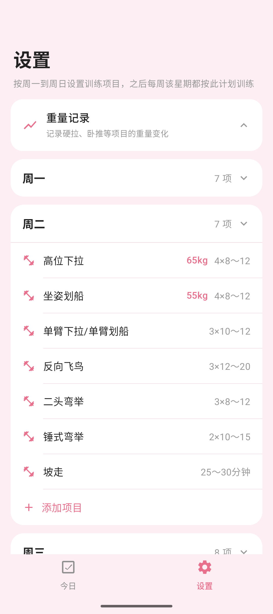
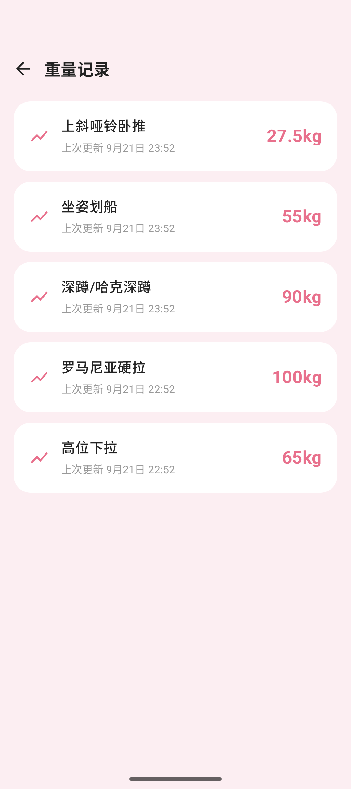

# 每日健身 Daily Fitness

一个简洁的 Android 每日健身计划与重量记录 App，粉色主题，使用 Jetpack Compose 构建，纯本地存储。

## 功能

### 今日训练

- 顶部日期条默认把今天放在正中间，可左右滑动或点击查看任意日期的训练计划，并显示当天完成进度
- **逐组滑动打卡**：右滑项目逐组累计完成（多组项目需集齐设定组数），全部集齐时有金色印章与粒子动效；左滑撤回一组
- 没有计划的日期显示休息状态

### 计划设置

- **按周模板**：按周一到周日设置训练项目，设置一次后以后每周的该星期都自动套用这套计划
- **拖拽排序**：长按某条项目，在当天内上下拖动即可调整训练顺序，粉色指示线标注插入位置
- **跨天复制**：把项目直接拖到其他星期的卡片上（卡片高亮提示），松手即复制到该天计划，原天项目保留
- **一键清空整天**：每天卡片标题栏右侧提供清空按钮，二次确认后删除该天全部项目（重量历史保留）
- **自定义项目**：自由填写项目名称、组数、次数 / 时长，支持次数范围（如 `4×6～10`）、分钟、步数、纯组数等写法

### 重量记录

- 为硬拉、卧推等项目记录训练重量，调整重量时自动记录时间
- 折线图展示重量增长过程，支持手动补记与删除单条记录

### 其他

- 纯本地存储：SharedPreferences + JSON，无需联网，无账号

## 界面预览

| 今日训练 | 计划设置 | 重量记录 |
| :---: | :---: | :---: |
|  |  |  |

## 技术栈

- Kotlin、Jetpack Compose、Material 3
- 单 Activity 架构，数据层为 SharedPreferences 序列化仓库
- minSdk 24 / targetSdk 37

## 构建

用 Android Studio 打开本目录，Gradle 同步后直接 Run；或使用命令行：

```bash
# Windows
gradlew.bat assembleDebug
# macOS / Linux
./gradlew assembleDebug
```

Debug 产物位于 `app/build/outputs/apk/debug/app-debug.apk`。

### Release 构建

Release 包使用项目根目录下的签名配置（`keystore.properties` 与 `*.jks` 已在 `.gitignore` 中忽略）：

```properties
storeFile=gym-release.jks
storePassword=你的库口令
keyAlias=gym
keyPassword=你的密钥口令
```

配置好后执行：

```bash
gradlew.bat assembleRelease     # Windows
./gradlew assembleRelease       # macOS / Linux
```

Release 产物位于 `app/build/outputs/apk/release/app-release.apk`。

## 下载

可在 [Releases](../../releases) 页面下载预编译 APK，最新版本为 [v1.3](../../releases/tag/v1.3)。

> 注意：v1.3 起为正式签名的 release 构建，与此前 debug 版签名不一致，覆盖安装会失败，需先卸载旧版再安装。

## License

[MIT](LICENSE)
