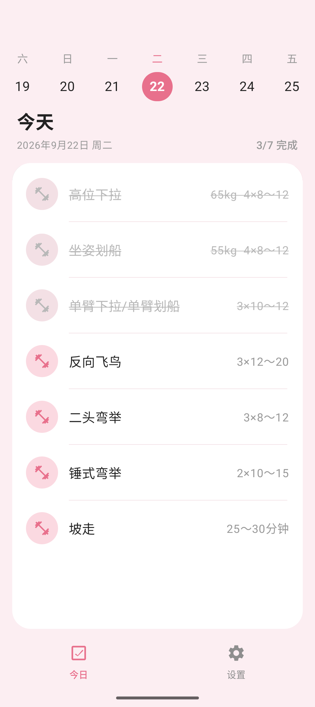
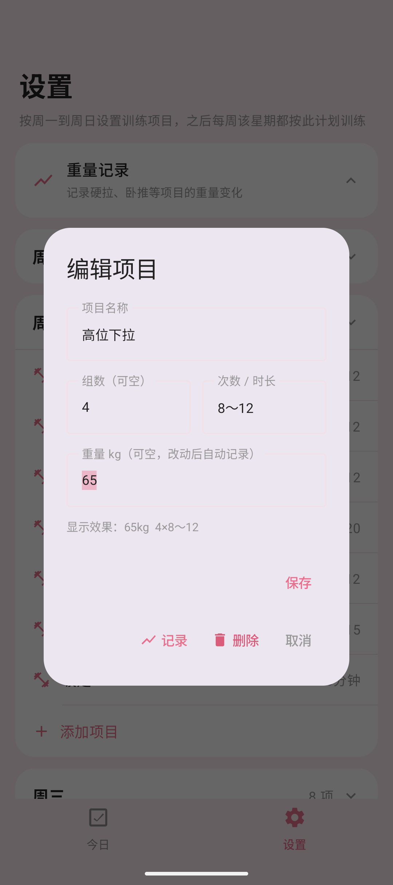
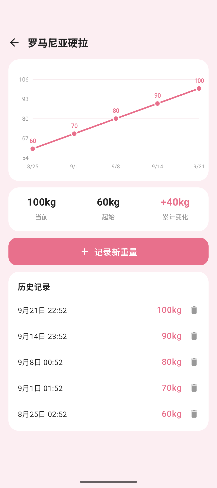
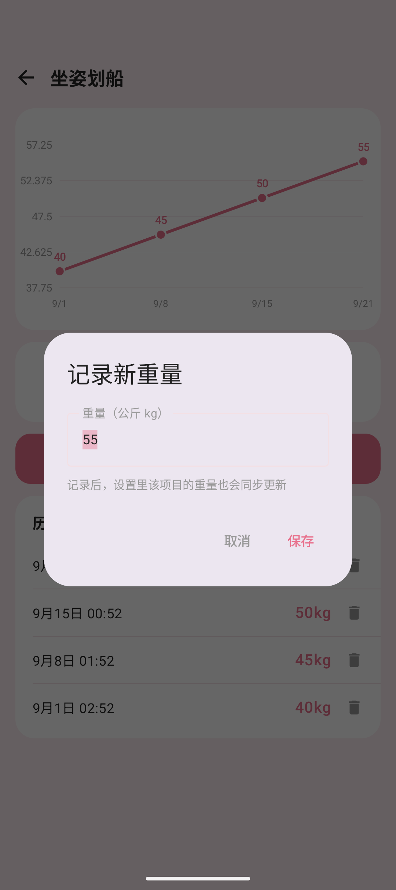

# 「我上次硬拉多少来着？」—— 被这句话折磨两年后，我写了个开源健身 App 🏋️

盒友们晚上好，先问个扎心的问题：

你在健身房，杠铃片都装好了，大脑突然一片空白 —— 我上次练这个，推的到底是多少来着？？？

别急着翻备忘录，先听我唠唠这事儿。

## 一、健身人的记性，是门玄学 🧠

我曾经特别自信：就那几个动作、那点重量，还能记不住？我脑子就是最好的训练日志。

现实教我做人：周一练完，周三站在器械跟前，「我高位下拉是 60 还是 65 来着？」；硬拉重量到底加没加，全靠当天的迷之自信。

后来我寻思下个 App 解决吧，结果 ——

开屏先看 5 秒广告；注册登录、手机号验证码一条龙；好不容易找到记录重量的地方 ——「该功能为会员专享，首月特惠 12 元」。

我：？？？我就想记个数字啊兄弟 😅

## 二、被逼急了，我自己写了一个

作为一个被逼急的程序员，我选择了最朴素的复仇方式：自己写一个，然后开源，让大家一起白嫖。

它叫「每日健身」，打开就是**今日训练** 👇

顶部一条日期带，今天永远在 C 位；想看看明天练啥、昨天练了啥，左右一划拉就行，完成了几个也写得明明白白。

练完一个动作，**手指在项目上往左一滑，当场打勾、整行划线**；手滑划错了？往右一滑就撤销。这手感用过就回不去，我现在练完一组划一下，比私教盯着都老实。

## 三、设置一次，每周自动循环 🔁

计划是按「周」走的：周一练胸、周二练背、周三练腿…… 你在设置里把周一到周日的项目排好，**以后每周自动循环这套计划**，不用天天安排。

项目完全自定义，想咋写咋写：

* 「4×6～10」这种组数次数，标准写法 ✅

* 「30 分钟」坡走、「12000 步」走路，也都认 ✅

* 重量单独填，卧推多少、硬拉多少，随你 ✅

## 四、我最爱的功能：重量它替我记着 📈

重头戏来了。所有记了重量的动作，全在这个页面集合：

你只要在设置里改了重量，它**自动把时间一起记下来**，不用手动打卡。点进去，一条折线图，这几个月是真涨了还是原地躺平，一目了然：

看这条一路向上的线，60 → 70 → 80 → 90 → 100，累计 +40kg，比任何鸡汤都上头。

忘了记？点「记录新重量」手动补；手滑记岔了？历史记录里单条删掉，互不影响 👇

## 五、关于白嫖这件事，我把话放这

它的底线：

* 🚫 没有广告，一个都没有

* 🚫 不要账号，不注册不登录

* 🚫 没有内购，不存在什么会员

* 📴 不联网，数据全在你自己手机里

* 💾 安装包 12M 左右，干净得像张白纸

技术上是 Kotlin + Jetpack Compose 写的，代码不整花里胡哨的，想学习 Compose 的盒友也可以拿去参考；数据纯本地，谁也拿不走。

## 六、地址收好，下课

📦 **开源仓库**（MIT 协议，随便造）：

[https://github.com/sanda-tt/daily-fitness](https://github.com/sanda-tt/daily-fitness)

📲 **不想自己编译的**，Releases 页面直接下 APK：

[https://github.com/sanda-tt/daily-fitness/releases](https://github.com/sanda-tt/daily-fitness/releases)

目前只有安卓版（Android 7.0 以上），iOS 的盒友对不住了，是真不会写（鞠躬）🙇

最后互动一下，顺手投个票，让我看看盒友们都是什么怪物 👀

> 🗳️ **此处插入投票**
>
> **投票标题：你硬拉什么水平？**（按单次最大重量 1RM 算）
>
> 1. 🦴 还没碰过硬拉，来围观的
> 2. 🍼 60kg 以下，空杆磨合期
> 3. 💪 60～100kg，健身房熟脸
> 4. 🔥 100～140kg，杠铃片开始往两边堆
> 5. 🐺 140～180kg，器械区你说了算
> 6. 👑 180kg+，隐藏的怪物
> 7. 📦 没练过，我的硬拉是把快递扛上六楼
> 8. 🦆 重量一般，嘴硬拉全场第一

**你最烦健身 App 的哪一点**——广告？会员？还是一打开就给你推蛋白粉？评论区也见，我挨个看。

\#健身 #开源 #App 推荐 #安卓 #健身打卡